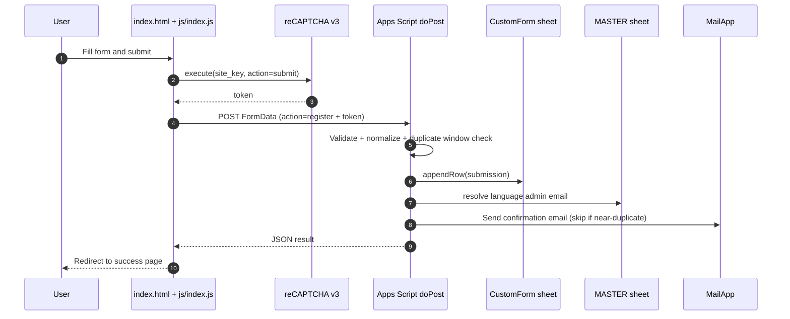
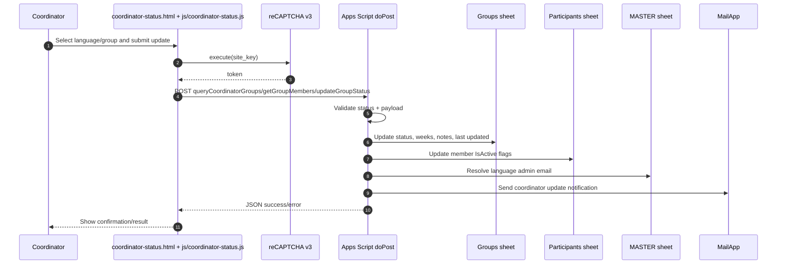
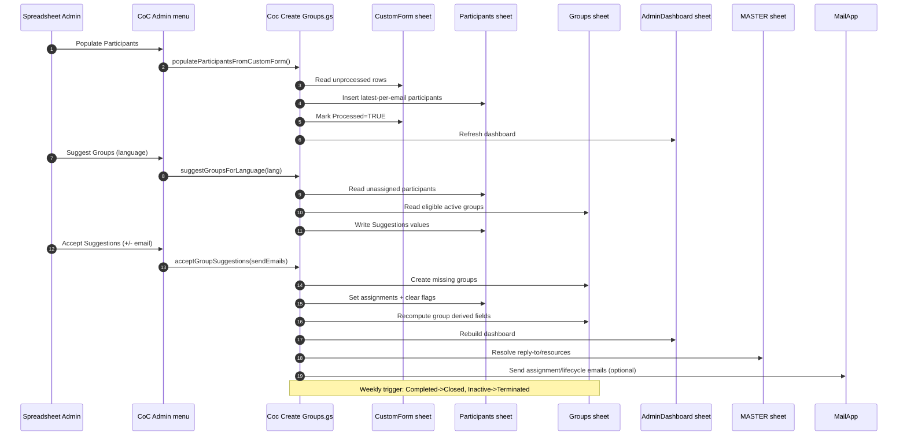

# CoC Registration and Group Operations

This repo contains a Google Apps Script + static frontend system for:

1. Participant registration (public form)
2. Group suggestion and assignment (admin in Google Sheets)
3. Coordinator status updates (public coordinator form)

This README is optimized for both human maintainers and coding agents.

---

## TL;DR (Agent Quickstart)

1. Read these files first:
   - `CoC Reg Form.gs`
   - `Coc Create Groups.gs`
   - `CoC Coordinator Update.gs`
   - `SetupSheets.gs`
   - `index.html`
   - `js/index.js`
2. Do not hardcode sheet column indexes. Use header lookup (`indexMap`).
3. Keep canonical language names exactly: `English`, `Tamil`, `Hindi`, `Kannada`, `Telugu`.
4. Slot matching is normalized into day + bucket (`Morning`, `Afternoon`, `Evening`, `Night`) by helpers in `Coc Create Groups.gs`.
5. Registration backend (`doPost`) is authoritative. Frontend validation is UX only.
6. If you change any field/column names, update all producer and consumer scripts together.

---

## Repository Map

- `index.html`: Participant registration form UI.
- `success.html`: Registration success page.
- `coordinator-status.html`: Coordinator status update UI.
- `js/index.js`: Registration submit flow (reCAPTCHA, fetch to web app).
- `js/coordinator-status.js`: Coordinator portal calls.
- `js/translations.js`: i18n labels.
- `CoC Reg Form.gs`: Main web app dispatcher (`doPost`) and registration backend.
- `Coc Create Groups.gs`: Admin menu, participant import, suggestions, accept flow, lifecycle jobs, email templates.
- `CoC Coordinator Update.gs`: Coordinator query/member/status handlers and notification emails.
- `SetupSheets.gs`: Bootstrap script to create core sheets and headers.
- `appsscript.json`: Apps Script project manifest (V8, web app config).

---

## Runtime and Deployment

### Apps Script manifest

Current `appsscript.json`:

- Runtime: `V8`
- Web app execute as: `USER_DEPLOYING`
- Web app access: `ANYONE_ANONYMOUS`

### Required Script Properties

- `RECAPTCHA_SECRET` (required): used by `verifyRecaptcha`.
- `MASTER_SHEET_URL` (optional): included in some admin emails.

### Frontend runtime values

In `js/index.js`, two values are currently hardcoded and must match your active deployment:

- `WEBAPP_URL`
- `SITE_KEY` (reCAPTCHA site key)

If you deploy a new web app version, update `WEBAPP_URL`.

---

## Data Model (Sheets)

All scripts rely on header names. Column order is not assumed.

## 1) `CustomForm` (raw submissions)

Expected fields written by `handleRegistration`:

1. `Timestamp`
2. `Language`
3. `Email`
4. `Name`
5. `WhatsApp`
6. `Center`
7. `EnglishAbility`
8. `PreferredTimes`
9. `Coordinator`
10. `Processed`
11. `Comments`
12. `DisclaimerConsent`

Notes:

- Duplicate submissions are still appended (append-only audit log).
- Duplicate detection only suppresses confirmation email if same email submitted within 5 minutes.

## 2) `Participants`

Created by `setupAllCoCSheets` with these headers:

1. `ParticipantID`
2. `Name`
3. `Email`
4. `WhatsApp`
5. `Language`
6. `Center`
7. `PreferredSlots`
8. `CoordinatorWilling`
9. `AssignedGroup`
10. `AssignmentStatus`
11. `IsGroupCoordinator`
12. `AcceptSuggestion`
13. `Suggestions`
14. `Notes`
15. `IsActive`

## 3) `Groups`

Created by `setupAllCoCSheets` with these headers:

1. `GroupID`
2. `GroupCreationDate`
3. `GroupName`
4. `Language`
5. `Day`
6. `Time`
7. `CoordinatorEmail`
8. `CoordinatorName`
9. `MemberCount`
10. `Status`
11. `Sequence`
12. `WeeksCompleted`
13. `Notes`
14. `LastUpdated`

Important:

- Some logic supports optional `CoordinatorWhatsApp`. It is not created by `SetupSheets.gs` by default.

## 4) `AdminDashboard`

Created by `setupAllCoCSheets` and fully rebuilt by `updateAdminDashboard`.

## 5) `MASTER`

Required for language-scoped admin routing and resource links.

Expected pattern:

- Header row with language columns (`English`, `Tamil`, `Hindi`, `Kannada`, `Telugu`).
- Record rows in first column (`RecordType` style), including:
  - `AdminEmail`
  - `CocOverview`
  - `CoCWeek1-20`
  - `CoCBooks`
  - `CoCPurchaseLink`

---

## API Surface (`doPost` actions)

Dispatcher in `CoC Reg Form.gs` handles:

1. `register`
2. `getAdminEmail`
3. `queryCoordinatorGroups`
4. `getGroupMembers`
5. `updateGroupStatus`

Security checks:

- Honeypot (`honey`) must be empty.
- reCAPTCHA token required for all action handlers that call `verifyRecaptcha`.

---

## Request Flow Diagrams

### 1) Registration flow

### 2) Coordinator update flow

### 3) Admin grouping and lifecycle flow

---

## Core Workflows

## A) Registration workflow

1. User submits `index.html` form.
2. `js/index.js` gets reCAPTCHA token and posts `FormData` to web app.
3. `handleRegistration` validates and appends to `CustomForm`.
4. Confirmation email is sent (unless identified as near-duplicate submission).

Validation highlights:

- Required: email, name, WhatsApp, center, coordinator answer, disclaimer consent, at least one preferred slot.
- WhatsApp accepted format after normalization: 8 to 15 digits.
- For non-English language, `EnglishAbility` is required.

## B) Populate participants

Menu action: `Populate Participants (All Languages)` -> `populateParticipantsFromCustomForm`.

Behavior:

- Ensures `Processed` column exists on `CustomForm`.
- For each email, only the latest unprocessed submission is transferred.
- Marks all submissions for that email as processed.
- Creates `ParticipantID` values (`P-0001` style).

## C) Suggest groups (per language)

Menu actions:

- `Suggest Groups - English`
- `Suggest Groups - Tamil`
- `Suggest Groups - Hindi`
- `Suggest Groups - Kannada`
- `Suggest Groups - Telugu`

Algorithm summary:

- Fills existing eligible active groups first (`WeeksCompleted <= 5`, capacity < 8).
- Uses slot normalization helpers:
  - `parseSlotDescriptor`
  - `buildCanonicalSlotKey`
  - `normalizeTimeBucket`
  - `inferFirstHour24_`
- Buckets supported by matching logic: `Morning`, `Afternoon`, `Evening`, `Night`.
- Creates `NEW -> CoC-Language-### (Slot)` suggestions for new groups.
- Flags unsplittable small clusters with `NEEDS_MANUAL_REVIEW`.

## D) Accept suggestions

Menu action: `Accept Suggestions and Email` (or no-email variant).

Behavior:

- Processes rows where `AcceptSuggestion` is checked.
- Creates missing groups as needed.
- Updates participant assignment fields.
- Refreshes derived group/dashboard views.
- Sends member/coordinator assignment emails (optional).

## E) Coordinator status updates

Coordinator portal flow uses actions:

- `queryCoordinatorGroups`
- `getGroupMembers`
- `updateGroupStatus`

Status changes allowed from portal submit: `Active`, `Inactive`, `Completed`.

Update notification email is sent to language admin and coordinator (when addresses are available).

## F) Lifecycle batch jobs

Daily:

- `dailyParticipantProcessingWithAlerts`
- Populates new participants and emails language admins for unassigned inflow.

Weekly:

- Preferred trigger model: per-language wrappers calling `weeklyLifecycleProcessingByLanguage_`.
- Transitions:
  - `Completed` groups -> `Closed`
  - `Inactive` groups -> `Terminated`
- Sends participant lifecycle emails and admin summary.

---

## Group and Participant Status Semantics

Group statuses used in system:

- `Active`
- `Inactive`
- `Completed`
- `Closed`
- `Terminated`

Participant assignment statuses commonly used:

- `Unassigned`
- `Assigned`
- `Discontinued`
- `Completed`

Participant activity is tracked separately via `IsActive`.

---

## Admin Menu (Spreadsheet)

Defined in `onOpen` in `Coc Create Groups.gs`:

1. Populate Participants (All Languages)
2. Suggest Groups per language
3. Accept Suggestions and Email
4. Accept Suggestions Without Email
5. Refresh Groups and Dashboard

---

## Operational Guardrails

1. Keep sheet headers stable. Header text is effectively your API contract.
2. Prefer additive changes over renaming existing fields.
3. Keep backend validation authoritative.
4. Do not disable form controls before building `FormData` for submit.
5. Preserve append-only behavior in `CustomForm` for traceability.
6. Keep language values canonical and case-consistent.

---

## Local Maintenance Checklist

When making changes, validate these paths end-to-end:

1. Registration submit succeeds and writes expected row.
2. `Populate Participants` imports latest-per-email correctly.
3. Suggestion run produces valid `Suggestions` output.
4. Acceptance updates groups/participants and clears checkboxes.
5. Coordinator portal can load groups and submit status changes.
6. Dashboard rebuild runs without missing-column errors.
7. Daily/weekly trigger functions run without runtime errors in logs.

---

## Trigger Setup (Recommended)

1. Daily trigger:
   - Function: `dailyParticipantProcessingWithAlerts`
   - Type: time-driven, once per day
2. Weekly triggers (per language):
   - `weeklyLifecycleProcessingEnglish`
   - `weeklyLifecycleProcessingTamil`
   - `weeklyLifecycleProcessingHindi`
   - `weeklyLifecycleProcessingKannada`
   - `weeklyLifecycleProcessingTelugu`

---

## Change Notes for Contributors and Agents

When updating behavior, include all of the following in the same PR/change set:

1. Script logic changes.
2. Sheet/header contract updates (if any).
3. Frontend field name updates (if any).
4. Email template and language label adjustments (if any).
5. README update describing new invariants.

If a change touches grouping or scheduling logic, also review helpers in `Coc Create Groups.gs` and ensure existing slot strings remain backward-compatible.
